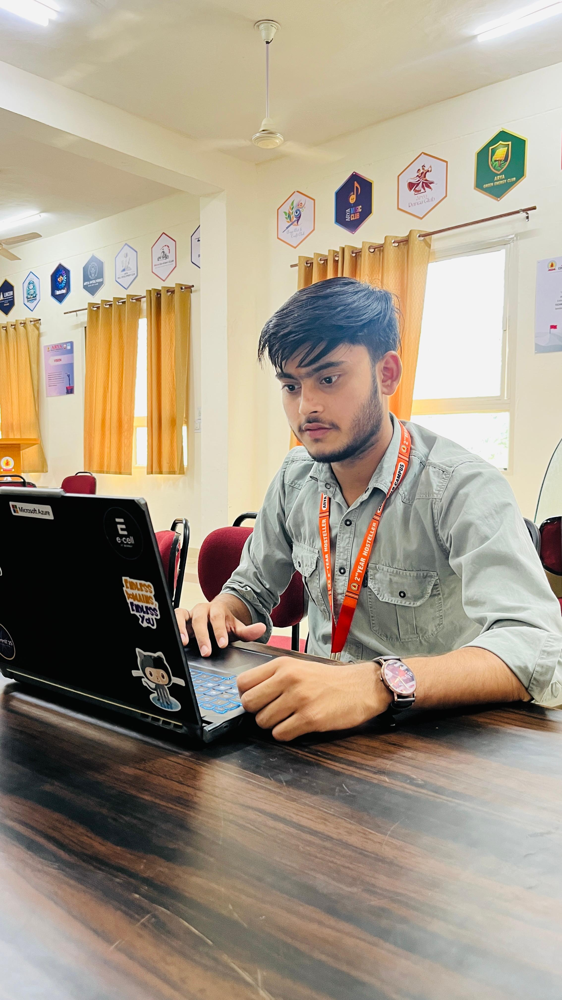

<div align="center">

<br/>

<h1>
  
</h1>


<br/><br/>

<a href="mailto:mksharmah675@gmail.com"></a>
&nbsp;
<a href="https://linkedin.com/in/mohit-sharma9761"></a>
&nbsp;

&nbsp;


<br/><br/>



<!-- 
  📸 TO SHOW YOUR ACTUAL PHOTO:
  1. Upload your photo as mohit.jpg to this repo
  2. Replace the src above with just: src="mohit.jpg"
-->

<br/>
<sub><b>Mohit Sharma</b> · ML Engineer · Jaipur, India 🇮🇳</sub>

<br/><br/>

> *"The best model is the one that ships to production — not the one that sits in a notebook."*

<br/>

</div>

---

## 🖥️ `whoami` — The Dev Behind the Models

<table>
<tr>
<td width="55%" valign="top">

```python
class Mohit:
    def __init__(self):
        self.name        = "Mohit Sharma"
        self.title       = "ML Engineer & AI Builder"
        self.college     = "Arya College of Engineering & IT"
        self.degree      = "B.Tech — AI & Data Science"
        self.cgpa        = 8.6
        self.batch       = "2023 → 2027"
        self.location    = "Jaipur, Rajasthan 🇮🇳"
        self.status      = "Open to internships & roles 🚀"

    @property
    def currently_building(self):
        return {
            "🧠 MLOps":   "Docker + Azure + GitHub Actions CI/CD",
            "🔬 Med AI":  "Retinopathy & Brain Tumor Classification",
            "📄 RAG":     "FAISS + Gemini AI document intelligence",
            "🤟 SignAI":  "Real-time ASL/ISL/TSL recognition",
        }

    @property
    def superpower(self):
        return "Research → Production in record time ⚡"

    def fun_facts(self):
        return [
            "🌌 Detected real asteroids before building ML models",
            "🏆 Top 6 / 750+ teams at CodeForge 2025",
            "🐳 My laptop: 100% sticker coverage achieved",
            "☕ Caffeine-to-model-accuracy correlation: high",
            "🔁 I refactor my code more than I refactor my life",
        ]

mohit = Mohit()
print(mohit.superpower)
# Output: Research → Production in record time ⚡
```

</td>
<td width="45%" valign="top" align="center">


<br/><br/>


<br/>

<br/>

<br/>


</td>
</tr>
</table>

---

## 🏆 Achievements & Highlights

<div align="center">

<table>
<tr>
<td align="center" width="220">


**Top 6 / 750+ Teams**
<br/>85%+ accuracy AI healthcare platform
<br/>*Microsoft · 2025*

</td>
<td align="center" width="220">


**4th Place · 78 Teams**
<br/>INR 2,000 Prize
<br/>*AI/ML Healthcare Solution*

</td>
<td align="center" width="220">


**AI Foundations 2025**
<br/>Oracle Corporation
<br/>*Cloud AI Certification*

</td>
<td align="center" width="220">


**IASC Recognition**
<br/>Astronomical Data Analysis
<br/>*International Recognition*

</td>
</tr>
</table>

</div>

---

## 💼 Work Experience

<div align="center">

```
╔══════════════════════════════════════════════════════════════════════╗
║  🏢  Qriocity  ·  ML Developer Intern  ·  Remote  ·  Dec 2025–May 2026  ║
╠══════════════════════════════════════════════════════════════════════╣
║  ▸ Containerized ML models with Docker + GitHub Actions CI/CD        ║
║  ▸ End-to-end pipelines: Python · PyTorch · Scikit-learn             ║
║  ▸ Flask REST APIs for production ML inference                       ║
║  ▸ Deployed AI solutions on Azure cloud · Worked in Agile teams      ║
╚══════════════════════════════════════════════════════════════════════╝
```

</div>

---

## 🚀 Featured Projects

<div align="center">

</div>

<br/>

<table>
<tr>
<td width="50%" valign="top">

### 🧠 MIND-A-EYE
> **AI Diagnostic Platform for Healthcare**

```
📌 Microsoft CodeForge 2025 Finalist — Top 6/750+
```

| Feature | Detail |
|:---|:---|
| 🔬 Model | EfficientNet (5-stage Retinopathy + 4-type Brain Tumor) |
| 🎯 Accuracy | **95%+** · 100+ concurrent users supported |
| 🤖 Chatbot | Gemini AI · 50+ diagnostic query types |
| 🐳 DevOps | Dockerized · CI/CD via GitHub Actions |


[](https://github.com/mohitsharmas97/MIND-A-EYE)

</td>
<td width="50%" valign="top">

### 🤟 SignLingua
> **Real-Time Sign Language Recognition**

```
🌍 Open-source · Multi-language sign support
```

| Feature | Detail |
|:---|:---|
| 🌐 Languages | ASL · ISL · TSL |
| 🖐️ Pipeline | MediaPipe 21-point hand landmark |
| ⚡ Backend | Decoupled FastAPI ML service |
| 🐳 Deploy | Docker-packaged, production-ready |


[](https://github.com/mohitsharmas97)

</td>
</tr>
<tr>
<td width="50%" valign="top">

### 📄 RAG PDF Chatbot
> **Enterprise-Grade Document Intelligence**

```
📚 Handles 1000-page docs · < 30 sec processing
```

| Feature | Detail |
|:---|:---|
| 📦 Scale | PDFs up to **1000 pages / 200 MB** |
| ⚡ Speed | 100-page docs in **< 30 seconds** |
| 🎯 Accuracy | **+40%** factual accuracy via FAISS |
| 🔄 MLOps | Model versioning & evaluation pipelines |


</td>
<td width="50%" valign="top">

### 🎤 Jarvis Voice Assistant
> **Browser-Based AI Voice Interface**

```
🌐 Zero installs · Fully browser-native · Always on
```

| Feature | Detail |
|:---|:---|
| 🌐 Integration | Gemini AI + real-time web search |
| 🎙️ Interface | Smart voice command handling |
| 💡 Platform | 100% browser-native, no installs |
| ⚡ Latency | Near real-time response pipeline |


[](https://github.com/mohitsharmas97/Jarvis-Voice-Assistant)

</td>
</tr>
</table>

---

## 🌱 Currently Exploring

<div align="center">

```
⚡ Transformer fine-tuning on medical imaging datasets
🔗 LLM Agents with tool-calling & memory (LangGraph)
📦 Kubernetes for scalable ML inference
🧪 MLflow experiment tracking in production pipelines
🌐 Multimodal AI — vision + language together
```

</div>

---

## 🛠️ Tech Stack

<div align="center">


<br/><br/>

**🐍 Languages**


<br/>

**🧠 ML / AI / Deep Learning**


<br/>

**☁️ MLOps & Cloud**


<br/>

**🌐 Backend & Web**


<br/>

**🔬 Data & Visualization**


</div>

## 📊 GitHub Stats & Activity

<div align="center">


<br/><br/>


<br/><br/>


</div>

---

## 🏅 Certifications

<div align="center">

| 🎖️ | 📜 Certification | 🏢 Issuer | 📅 Year |
|:---:|:---|:---|:---:|
| ☁️ | **Oracle Cloud Infrastructure 2025 AI Foundations Associate** | Oracle Corporation | 2025 |
| 🌌 | **Provisional Asteroid Detection Recognition** | IASC | 2024 |
| 🎓 | **Elite Certificate — Object Oriented Programming** | NPTEL · IIT Roorkee | 2024 |

</div>

---

## ⚔️ Competitive Programming

<div align="center">


<br/><br/>

[](https://leetcode.com/u/mohitsharmas97/)
&nbsp;
[](https://www.codechef.com/users/mohitsharmas97)

</div>

---

## 🐍 Contribution Snake

<div align="center">

<picture>
  <source media="(prefers-color-scheme: dark)" srcset="https://raw.githubusercontent.com/mohitsharmas97/mohitsharmas97/output/github-snake-dark.svg" />
  <source media="(prefers-color-scheme: light)" srcset="https://raw.githubusercontent.com/mohitsharmas97/mohitsharmas97/output/github-snake.svg" />
  
</picture>

</div>

---

## 📬 Let's Connect & Build Together

<div align="center">


<br/><br/>

[](mailto:mksharmah675@gmail.com)
&nbsp;
[](https://linkedin.com/in/mohit-sharma9761)
&nbsp;
[](https://github.com/mohitsharmas97)
&nbsp;
[](https://leetcode.com/u/mohitsharmas97/)

<br/><br/>


</div>
